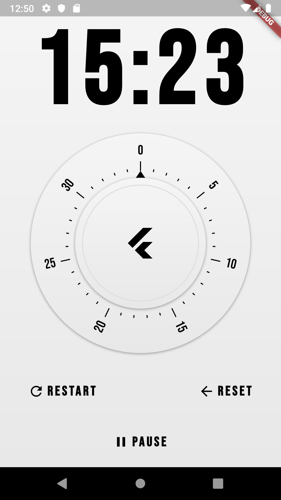

# Egg Timer Flutter

UI challenge to create an egg timer.

## Screenshot

## Getting Started

[Youtube](https://www.youtube.com/watch?v=svxUUz5mi9s)

[Dribble](https://dribbble.com/shots/2764686-Original-timer-app-UX-interaction)

[Egg Icon](https://www.flaticon.com/free-icon/boiled-egg_112280)
